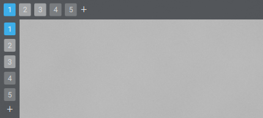

# Virtual Desktop Bar

This repository is a modification of the [virtual-desktop-bar](https://github.com/wsdfhjxc/virtual-desktop-bar). That widget is an alternative to Paginator, which let you customize the desktop buttons and their labels. Nevertheless, they decide to keep it simple and minimalistic and not develop the option to show images for each desktop, and for ricing KDE that recourse can be very powerful. So in this code, the widget is modified to implement that option. You can see it more in detail in the rest of the README.

## Features

* Switching, adding, removing, renaming, moving desktops
* Mouse dragging, clicking, scrolling support, context menu, keyboard shortcuts
* Automation: switching, renaming desktops, executing commands, dynamic desktops
* Customizable size, spacing, font, color and style of desktop buttons and labels
* Showing a desktop button only for the current desktop or only for occupied desktops
* Formatting the desktop label's style (name, number, Roman number, window's name, etc.)
* Limiting the maximum length of desktop labels, displaying them as UPPERCASED
* Customizable style and colors of desktop indicators in different states (idle, current, occupied etc.)
* Option to have icons for each desktop instead of text and change their size

and a few more not mentioned options...

## Screenshots

Adding, renaming, moving, removing a desktop:


Various desktop label styles:


Various desktop indicator styles:


Partial support also for vertical panels:



Desktop icon configuration:


## Installation

First, you need to install some required dependencies:

* On Fedora run: `./scripts/install-dependencies-fedora.sh`
* On openSUSE run: `./scripts/install-dependencies-opensuse.sh`
* On Arch Linux or Manjaro run: `./scripts/install-dependencies-arch.sh`
* On Kubuntu or KDE neon run: `./scripts/install-dependencies-ubuntu.sh`

Then, to compile the source code and install the applet run: `./scripts/install-applet.sh`

Note: This also applies if you want to upgrade to a newer version.

Note: If you want to remove the applet run: `./scripts/uninstall-applet.sh`

After that, you should be able to find Virtual Desktop Bar in the Add Widgets menu.

## Configuration

The applet has some options regarding its behavior and visuals. You'll find them in the configuration dialog.

Don't get fooled by an empty Keyboard Shortcuts section though. It's an imposed thing, common for all plasmoids.

There are global keyboard shortcuts, but you have to configure them in the Global Shortcuts System Settings Module. They should be available under KWin, Plasma or Latte Dock component, depending on the Plasma's mood and where have you placed the applet. All of the shortcuts have the `Virtual Desktop Bar` prefix for easier recognition.

### Icon Configuration

When you select the icon label style, the icons that are shown are located on ```/usr/share/virtual-desktop-bar/desktop-icons/``` but you can use different folders, just write the global path on the configuration (remember the last "/"). In that folder, you have to place one SVG for each desktop with the format ```desktop_<N>.svg (N=1...20)``` and it will be automatically linked and shown on the widget.

## Known issues

* Virtual desktops are shared by all monitors (KWin's limitation)
* Support for Plasma Wayland session isn't there yet
* The code behind this applet is a mess that doesn't follow the proper way of writing plasmoids
* Dynamic virtual desktop management doesn't play nice with KWin scripts (see the explanation below)

## Compatibility with KWin scripts

The plasmoid does some things which results of are not exposed through the KWin scripting API. This is related to dynamic desktops, moving desktops, removing desktops other than the last one. These are non-native features. Because of that, KWin scripts tracking desktops or windows (for example tiling scripts) in most cases will be confused and will not react properly to performed actions (maybe except the dynamic desktops feature, depends on the script).

Nothing can be done about it, as long as KWin scripting API does not support signals like:

 * `desktopRemoved(QString id)`
 * `desktopsReplaced(QString id1, QString id2)`

To avoid issues while using KWin scripts, do not use the features mentioned above.

## Compatibility with window managers other than KWin

Some features, even the basic ones, like adding or removing desktops, might not work if KWin is replaced with a different window manager, be it i3, bspwm or any other. Such issues are unlikely to be addressed. However, the plasmoid should still display desktops and their state, so it can act as a visual addition with labels and indicators.
